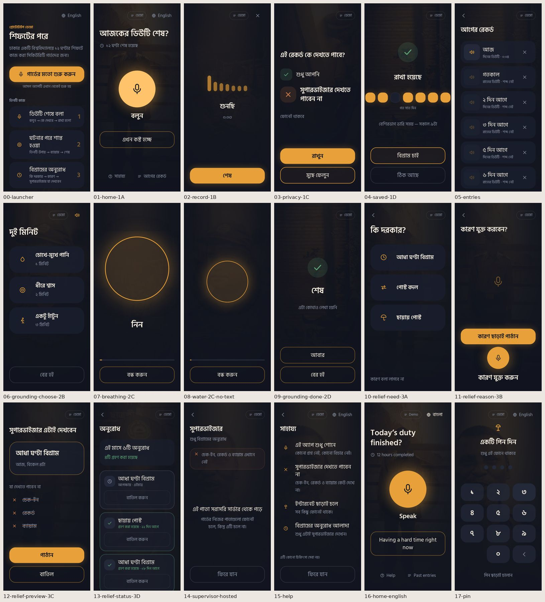

# AUDIT.md — After the Shift, prototype v1

**Phase 1 of the rebuild. No code was changed.**
Audited commit `b8b2409` (main, 20 Sep 2026) at a **390×844** mobile viewport, 2× density.

### How this was tested

- **The live site could not be opened from the audit sandbox** (its network policy blocks `*.github.io`). To get around that, the same commit was built exactly as the Pages workflow builds it (`BASE_PATH=/After_the_shift/`) and served by a small server that copies GitHub Pages' behaviour: real files return 200, and anything else returns `404.html` **with HTTP status 404**. Every result below comes from that replica, so the behaviour should match, but it has not been checked on the real host. **Before Phase 3, open `https://meteorboyf.github.io/After_the_shift/demo` once in your browser and check two things. Do you see the app or GitHub's own 404 page? And in the repo settings, is Pages → Source set to "GitHub Actions"?** If it shows GitHub's page, Pages is not serving the Actions build at all, and finding B1 gets worse.
- All three tasks were run end to end with Playwright, using a fake microphone. Each step was timed, and every screen was checked automatically for text inputs, tap targets under 64 px, text under 18 px, and content cut off by the viewport.
- Every route was pasted into a fresh browser profile, to act like an examiner opening a link.
- The contrast of every token pair was calculated against WCAG.
- The source was read in full: routing, stores, the outbox, seeding, all screens and the i18n tables.

### Severity key

| | Meaning |
|---|---|
| **S1** | Breaks the demo, or breaks a claim the research depends on. Must be fixed. |
| **S2** | A guard would hesitate or get lost, or an examiner would notice. |
| **S3** | Polish. |

---

## 0. The brief's four suspicions — checked

| Brief §1 suspicion | Verdict | Evidence |
|---|---|---|
| 1. Deep links 404 on Pages | **Half right.** A `404.html` fallback exists, so the app does load. But every deep link returns **HTTP 404**, and on a first visit **every route redirects to `/demo`**. A pasted link never opens the screen it names. See B1. | `deeplinks.py`: 15 of 15 routes returned `http=404, landed=/demo` |
| 2. Backend can't run on Pages | **Mostly handled.** The API client turns itself off when no backend is set, and the stores are IndexedDB-first. **One exception: the supervisor view is empty and non-functional on the hosted site.** See B2. | `lib/api.js`, `store/*.js`, screenshot 14 |
| 3. No seeded state | **Wrong. Seeding already works.** Five check-ins and five relief requests (four accepted) are seeded on first load, and the tally reads `এই মাসে ৫টি অনুরোধ / ৪টি গ্রহণ`. | `lib/demoSeed.js`, screenshot 13 |
| 4. Generic look | **Partly right.** The palette and amber glow are already on-deck. What is missing is atmosphere, hierarchy and typographic character. See §3. | §3 |

The v1 codebase is careful about the non-negotiables. Several parts should be **kept** in the rebuild (see §6). The main problems are the front door, the hosted demo path, and the fact that the app does not *look like* it follows from the research.

---

## 1. Broken — doesn't work

### B1 · S1 — A pasted link never reaches its screen, and every deep link returns HTTP 404
- **What happens:** Pasting `/After_the_shift/relief/status` into a fresh tab: the server returns **404**, the app boots from `404.html`, `Gate` sees `demoStarted === false`, and the visitor is **redirected to `/demo`**. This happens on all 15 routes.
- **Also:** On a returning visit, `/relief/preview` and `/checkin/privacy` bounce to `/relief` or `/` because they have no draft in memory. `/styleguide` doesn't exist yet and falls through to `/`.
- **Why it matters:** "/demo returns 404" is literally true, since the status code is 404. Link previewers, some school proxies and Lighthouse treat that page as missing. In the presentation, a link to a specific screen lands on the launcher.
- **Fix:** Switch to `HashRouter` (no server status involved, so it survives any static host). Let the launcher gate only `/`, never an explicit route. Give draft-dependent screens a **seeded fallback draft** so they render when opened directly.

### B2 · S1 — The supervisor view is dead on the hosted site
- **What happens:** `/supervisor` shows "এই পাতা সরাসরি সার্ভার থেকে পড়ে… কিন্তু এটি চলে না" and an empty list. You cannot accept a request, so the status never changes from `অপেক্ষায়`.
- **Why it matters:** This screen is the **only live proof of the privacy wall** in the presentation, and it does not work on the URL you will present from.
- **Fix:** Add a local supervisor adapter that reads the same `supervisorViewOf()` projection from IndexedDB. The split-screen privacy wall in brief §5.8 depends on this.
- *Screenshot:* [14](docs/audit/14-supervisor-hosted.jpg)

### B3 · S1 — The app does not load offline
- **What happens:** Load the site, go offline, reload: `net::ERR_INTERNET_DISCONNECTED`. There is no service worker and no web manifest.
- **Why it matters:** SPEC rule 8 and brief rule 8 ("works fully offline"). P7 has no data at home. Data survives offline, but **the app shell does not**.
- **Fix:** Add `vite-plugin-pwa` with a precached app shell, fonts and the guard images. The images need resizing first (see U6).

### B4 · S2 — The spoken reason in Task 3 goes somewhere the guard is never shown
- **What happens:** 3B → "কারণ যুক্ত করুন" → speak → "শেষ" goes straight to 3C. The preview shows **only the type and time. Nothing says a voice reason is attached**, even though the payload holds `reasonAudioBase64` and the outbox sends it to `/api/relief`. The supervisor endpoint deliberately drops it (`ReliefCard`).
- **Why it matters:**
  - Attaching a reason has **no visible effect**, which breaks rule 7.
  - The guard's voice leaves the phone to a server with no named recipient. That is the exact fear P6 described ("if they see it, then they take our statement").
  - It also contradicts SPEC 3C: "render from the same payload the API will send". The preview renders a *projection* of the payload, not the payload.
- **This needs a decision from you** (see §7 Q2).
- *Screenshots:* [11](docs/audit/11-relief-reason-3B.jpg), [12](docs/audit/12-relief-preview-3C.jpg)

### B5 · S2 — Tapping the word "বলুন" does nothing
- **What happens:** On 1A the label `বলুন` is a `` **outside** the `<button>`. A guard who taps the big word under the mic gets no response. This was reproduced in the first test pass: the URL stayed at `/`.
- **Fix:** Make the circle and its label one tappable element.

### B6 · S2 — Withdrawing an old, accepted request deletes it from the tally
- **What happens:** 3D shows `বাতিল করুন` on **every** request, including ones accepted 22 days ago. Withdrawing one removes it from storage, so the monthly tally drops from 5 to 4.
- **Why it matters:** The tally is the answer to P7, and one tap quietly erases the proof. Withdrawing something that has already happened is also meaningless.
- **Fix:** Offer withdraw only while a request is `PENDING`. A withdrawn request should stay in history as `ফিরিয়ে নেওয়া` and not be deleted.
- *Screenshot:* [13](docs/audit/13-relief-status-3D.jpg)

### B7 · S2 — Water and walk exercises have no on-screen instruction
- **What happens:** `/grounding/water` and `/grounding/walk` show only a pulsing circle and a Stop button. The instruction (`চোখে-মুখে ঠান্ডা পানি দিন`) is **spoken once** through `speechSynthesis` with `lang='bn-BD'`, and the code never checks whether a Bangla voice exists.
- **Why it matters:** Most Windows/Chrome setups and many Android phones have no Bangla voice. Those devices either stay silent or read Bangla with an English voice. On a projector with the sound off, the examiner sees an empty circle for 60–180 seconds.
- **Fix:** Show one line of instruction plus an icon on screen. Only use TTS if a `bn` voice is found; otherwise play **pre-recorded Bangla audio clips**, which also serve the IVR simulation in §5.13 later.
- *Screenshot:* [08](docs/audit/08-water-2C-no-text.jpg)

### B8 · S3 — The breathing "hold" phase is labelled "নিন" (In)
- **What happens:** Timing is exactly 4 s / 2 s / 6 s. It was measured: scale reaches 1.6 at 4.0 s, holds to 6.0 s, and returns to 1.0 at 12.0 s. But during the 2 s hold the label still reads `নিন`.
- **Fix:** Show `ধরে রাখুন`, or dim the word during the hold. Say nothing aloud during the hold.

---

## 2. Confusing — works, but a guard would get lost

### C1 · S1 — The front door is a presenter's launcher, not the app
- **What happens:** First visit lands on `/demo`: a scrolling list in Bangla, with task numbers set in Latin digits `1 2 3` and a "reset" button. The guard app sits one tap away behind `গার্ডের মতো শুরু করুন`.
- **Also:** A `ডেমো` chip then sits on every screen next to `English`, making two pills top-right before the zone badge the brief asks for is even added.
- **Fix:** The app opens on Home. The launcher becomes **Presenter mode** (brief §5.7), which renders beside a phone frame on desktop and never inside the guard's UI.
- *Screenshot:* [00](docs/audit/00-launcher.jpg)

### C2 · S1 — Task 3 cannot be reached from Home
- **What happens:** 1A has no route to relief. The only way in is to finish a check-in first (1D → `বিশ্রাম চাই`). A guard who just wants half an hour of rest has to record a voice entry to ask for it.
- **Why it matters:** This contradicts Finding 6: the relief guards want is logistical, not expressive.
- **Fix:** The brief's shift-home tiles (`বিশ্রাম চাই` on Home).

### C3 · S2 — Home asks a question that is only true twice a day
- **What happens:** `আজকের ডিউটি শেষ?` and `১২ ঘণ্টা শেষ হয়েছে` are hard-coded (`hours: 12`). At 2 pm on a day shift, the app tells the guard his 12 hours are done.
- **Fix:** The shift-home card (§5.1) computes this from the roster.

### C4 · S2 — The "heaviest time" insight measures the wrong thing
- **What happens:** `বেশিরভাগ ভারি সময় — সকাল ৯টা` is the most common hour at which **check-ins were recorded**. Guards record *after* a shift, so this line reports when he talks, not when the shift was heavy. The seeded 9 am is simply the morning after a night shift.
- **Why it matters:** An examiner who asks "how is that computed?" exposes a gap in the claim.
- **Fix:** Replace it with something true and useful, such as "this week: 3 check-ins after night shifts, 1 after day shifts". Or, with a quick tap at save time (not a feeling, just "when during the shift?": start / middle / end), derive the actual heavy hour. The second option needs your OK (§7 Q4).

### C5 · S2 — The week strip is unreadable
- **What happens:** Seven unlabelled rounded squares that run edge to edge (4 px from the screen edge, ignoring the 24 px gutter; the glow is clipped). The caption `গত সাত দিন` is 15.75 px muted grey. There is no today marker and no direction.
- **Background:** v1 left the labels off on purpose, so that gaps can't be named ("you missed Tuesday"). That reasoning is sound.
- **Fix:** Keep the strip unlabelled, but mark *today* and add an arrow of time, so it reads as a record rather than a pattern of dots.
- *Screenshot:* [04](docs/audit/04-saved-1D.jpg)

### C6 · S2 — 3B has two microphones and a void
- **What happens:** A faint mic icon floats in the middle of an otherwise empty screen, then comes the primary button, then a **second**, real mic button labelled `কারণ যুক্ত করুন`. It is unclear which mic records.
- *Screenshot:* [11](docs/audit/11-relief-reason-3B.jpg)

### C7 · S2 — One icon means three things
- **What happens:** The custom `lamp` icon (used for the app mark, `হোম` in the launcher, and `ইন্টারনেট ছাড়াই চলে` in Help) is almost the same shape as the `shade` umbrella on 3A (`ছায়ায় পোস্ট`).
- **Also:** The icons are hand-drawn SVGs at 20–26 px, not Lucide at 28 px or more. A guard navigating by icon alone can't tell them apart.
- *Screenshots:* [15](docs/audit/15-help.jpg), [10](docs/audit/10-relief-need-3A.jpg), [17](docs/audit/17-pin.jpg)

### C8 · S2 — Most seeded entries in "আগের রেকর্ড" cannot play
- **What happens:** Every seeded row shows a greyed speaker and `শব্দ নেই`, so five of six rows are dead controls on first view. Leaving out fake audio was an honest choice. The fix is short neutral demo clips, clearly marked as demo audio, or no play control on those rows at all.
- **Also:** Delete (`×`) is instant with no undo. No confirmation is right, but one mis-tap destroys a recording permanently. Add a 5-second "ফিরিয়ে আনুন" (undo).
- *Screenshot:* [05](docs/audit/05-entries.jpg)

### C9 · S3 — Stopping an exercise drops the guard on Home without a word
- **What happens:** `বন্ধ করুন` goes straight to `/`. That is correct: rule 4 says exit instantly. But Home then asks `আজকের ডিউটি শেষ?`, which is jarring right after an incident.
- **Fix:** Go back to where the guard came from.

### C10 · S3 — The PIN screen takes over after the launcher's "পিন স্ক্রিন"
- **What happens:** Opening it clears the PIN and forces set-up on every later visit until the guard sets one or skips.

---

## 3. Ugly — works, looks poor

### U1 · S1 — No atmosphere
- **What happens:** The background is a flat `#12151F`. The "light source" is a 15% radial gradient hidden under a 60–100% ink gradient. There is no grain.
- **Why it matters:** On a projector this reads as a dark template, not "a lamp left on".

### U2 · S1 — Guard photos read as a muddy smear
- **What happens:** Greyscale plus an amber `mix-blend-color` layer at 0.26–0.32 opacity, *under* a near-opaque ink gradient. The result is a brown blur that is neither atmosphere nor visible illustration (1A, 1C, 1D, 3D, the supervisor view).
- **Also:** On the PIN screen, a **large, recognisable smiling face** sits behind the keypad. See [17](docs/audit/17-pin.jpg).

### U3 · S2 — One typeface, no display voice
- **What happens:** Hind Siliguri is used for everything, including the English. Headings vary with no system behind them: 1A and 3A use `text-display`, while 1C, 3B and 3C use a smaller `text-label-lg`, so the privacy question, the most important heading in the app, is **smaller** than the home heading.

### U4 · S2 — Cards are flat and all alike
- **What happens:** Every card is an `ink-raised` rounded rectangle with no top-edge highlight and no depth. The three 3A options, the three 2B options, Help rows and entries all look the same, so nothing signals importance.

### U5 · S2 — Primary and secondary actions compete
- **What happens:** 1D uses two outline buttons, and the amber-outlined `বিশ্রাম চাই` reads as the primary even though it leaves the task. 1C uses two equal buttons, which is right per spec, but they are only 72 px apart vertically, with 300 px of empty space above.

### U6 · S3 — Image weight
- **What happens:** The 29 photos total about 4 MB, and some are 1600 px wide, while they are shown at 30% opacity behind a 480 px column. They need resizing before they can be precached (see B3).

---

## 4. Off-spec — violates a SPEC.md or brief rule

| # | Sev | Rule | Violation | Where |
|---|---|---|---|---|
| O1 | S1 | Brief §3 / SPEC §4: **contrast ≥ 7:1** for primary text | `muted #8A93A6` on ink is **5.9:1** (4.7:1 on raised cards). It is used for **privacy statements** that rule 5 says must be visible: `ফোনেই থাকবে`, `কারণ বলা লাগবে না`, `এটা কোথাও লেখা হয়নি`, `যা দেখতে পাবেন না`. `ok` green is 6.4:1 and `warn` is 5.5:1. | 1C, 3A, 2D, 3C, 3D |
| O2 | S2 | Brief §3: **Bangla never below 18 px** | 15.75 px (`text-sm`) on: the demo chip, entry meta (`রাতের ডিউটি · শব্দ নেই`), status meta (`গ্রহণ করা হয়েছে · ২২ দিন আগে`), `গত সাত দিন`, `এটি কোনো চিকিৎসা সেবা নয়` | 1D, entries, 3D, Help |
| O3 | S2 | Brief §3: tap targets ≥ 64 px | Demo chip is **86×38**. Everything else passed. | all screens |
| O4 | S1 | Rule 8 offline | No app-shell caching (B3) | — |
| O5 | S2 | SPEC 3C: preview from the **same payload** | Preview shows a projection. The reason audio is sent but not shown (B4). | 3C |
| O6 | S2 | SPEC §5: images reflect **context** | `after_incident_01.jpg` shows what looks like a **Bangladesh Police** officer, not a campus guard. `relief_granted_01.jpg` is a man weaving a net. Several `walking_*` images carry third-party branding (a "Generation" vest, an Islami Bank ATM). The file names don't match what's in the photos. | [contact sheet](docs/audit/guard-images-contact-sheet.jpg) |
| O7 | S2 | Brief §3: icons are Lucide, 28 px or more, stroke 1.75 | Custom SVGs at 16–26 px | all |
| O8 | S2 | Brief §3: long-press reads the label aloud | Not implemented | all |
| O9 | S3 | Brief §3: designed empty and loading states | None exist. The supervisor "empty" state is an error message. | 14 |
| O10 | — | Brief §4b: zone badge on every screen | Not implemented (new requirement) | all |
| O11 | — | Brief §5.1: home is a shift companion | Home is a wellbeing prompt (new requirement) | 1A |

**Rules checked and passing:**

- **Zero text inputs:** 0 `input`/`textarea`/`select`/`contenteditable` on every screen.
- **No mood, rating or feeling input** anywhere.
- **No streaks, badges, reminders or notifications.**
- **Grounding exit** is full width and instant, with no confirmation.
- **Supervisor package** has no dependency on the check-in or grounding repositories (backend).
- **The Bangla/English toggle works.**
- **`prefers-reduced-motion`** is used in 10 components.
- **Breathing timing is exact.**

**Timing:** each task completes in under 60 s. By automation, Task 1 took 9 s plus speaking time, Task 2 reached the exercise in 2 taps, and Task 3 took 9 s.

---

## 5. An ethics flag that is not in the brief — the guard photographs

The contact sheet shows that `night_post_01–11` appear to be **real guards photographed on the UIU campus** (the turnstiles and brick walls are recognisable), with faces clearly visible. Most of the other photos look like they came from the web: news or stock photos, some with third-party branding.

For a project whose central claim is *"guards fear being seen"*, putting recognisable faces of real campus guards into the product, and projecting them in front of a class, cuts against the research. An HCI examiner may ask about consent. The web images may also carry copyright restrictions.

This needs your call before Phase 2 (§7 Q1).

---

## 6. What v1 got right — keep it

- **Local-first stores** (`idb-keyval`) with a durable outbox, API auto-disabled on hosted builds, and correct seeding. Keep this; it becomes the data layer behind the zone model.
- **`buildReliefPayload` / `supervisorViewOf`**: a single projection shared by preview and supervisor. That is the right architecture for the zone model. It needs extending to all three zones, not replacing.
- **Backend privacy wall** enforced by package dependencies, with `GroundingCompletion` having no user key.
- **Self-hosted Hind Siliguri**, `BASE_URL`-aware asset paths, and `<html lang>` kept in sync with the toggle.
- **Breathing engine** (`lib/exercises.js`): the timing is exact, with speech and haptic cues.
- **i18n** with Bangla numerals localised at render time.
- **Many deliberate absences**, documented in code comments. These are worth quoting in DEMO.md.

---

## 7. Decisions I need from you before Phase 2

**Q1. Guard photos.** Pick one:

- (a) Keep them as-is, as the brief says.
- (b) Keep only campus shots and treat them so no face is identifiable (heavy blur or duotone, cropped to posts, gates and lamps, no people).
- (c) Replace them with drawn silhouette illustrations made in the same amber/navy system.

I recommend **(b) or (c)**, and (c) gives the most coherent look.

**Q2. The spoken reason in Task 3.** Either:

- (a) The supervisor **does** hear it. The preview then shows "আপনার কণ্ঠে কারণ — সুপারভাইজার শুনবেন" with a play button.
- (b) Drop the attach-reason step entirely.

Right now it is sent but never shown, which is the worst of both. I recommend **(a)**, because SPEC says the guard "controls whether any explanation is attached", which implies someone receives it.

**Q3. Launcher.** Confirm that the app opens on Home and the current launcher moves into Presenter mode (desktop only).

**Q4. "Heaviest time" line.** Pick one:

- (a) Replace it with a plain count of check-ins after day vs night shifts.
- (b) Add one optional tap at save time ("শুরুতে / মাঝে / শেষে", meaning *when* in the shift, not *how*) to compute a real heavy period.

**(b)** is a new input, so I won't add it without your OK.

**Q5. Commit trailers.** `CLAUDE.md` says no `Co-Authored-By` trailer because this is graded coursework. I will follow that unless you say otherwise.

---

### Reproduce this audit
The scripts are not committed. They ran from the session workspace: a Pages-replica server, a Playwright walkthrough, a deep-link test, an offline test and a contrast calculation. I can add them under `docs/audit/scripts/` if you want them in the repo.
